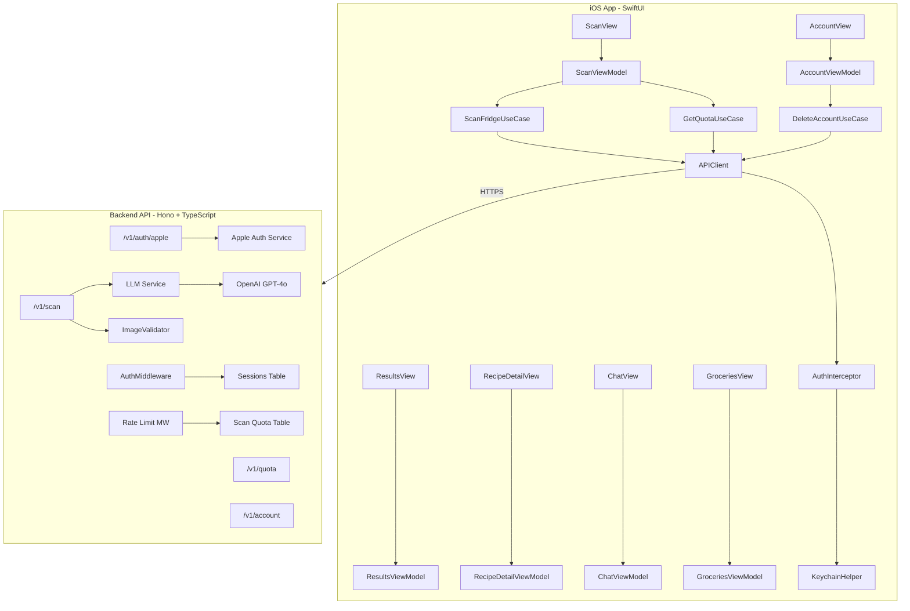

# Kiwi Personal Cook — Project Status and Roadmap

## Quick Reference

| Metric | Value |
| ------ | ----- |
| **Completion** | ~95% (iOS app + backend API + deployed infrastructure) |
| **Top blockers** | App Store prep, UI polish, test coverage |
| **Key decisions** | See [Key Decisions (Updated 2026-02-22)](#key-decisions-updated-2026-02-22) below |

**Agent update rule:** When any agent completes (or materially changes) a roadmap step, it must update this document in the same change set.

---

## End Goal

Kiwi is a personal cooking assistant targeting **Apple Design Awards quality**. Users photograph their fridge, the app identifies ingredients via GPT-4o vision, and returns 2-4 quick recipe recommendations with substitutions. The app is privacy-first (no image storage, EXIF stripping, anonymized logging) with Sign in with Apple auth and a 4-scans-per-day rate limit.

---

## Architecture Overview

---

## What Has Been Done

### iOS App ([apps/ios/Kiwi/](apps/ios/Kiwi/))

| Area | Status | Notes |
| ---- | ------ | ----- |

**Fully Implemented (production-ready):**

- **App entry point** — [KiwiApp.swift](apps/ios/Kiwi/App/KiwiApp.swift), [AppState.swift](apps/ios/Kiwi/App/AppState.swift): Auth routing, Keychain persistence, Observable macro
- **Scan feature** — [Features/Scan/](apps/ios/Kiwi/Features/Scan/): Camera/library picker, quota badge, image selection, `ImagePicker` UIKit bridge
- **Results feature** — [Features/Results/](apps/ios/Kiwi/Features/Results/): Loading/error/success states, ingredient list with removal, recipe cards, retry
- **RecipeDetail feature** — [Features/RecipeDetail/](apps/ios/Kiwi/Features/RecipeDetail/): Available/missing ingredients, substitutions, numbered steps, "Make It Faster" tip
- **Account feature** — [Features/Account/](apps/ios/Kiwi/Features/Account/): Sign in with Apple, sign-out, delete account with confirmation, privacy notice
- **Domain models** — [Domain/Models/](apps/ios/Kiwi/Domain/Models/): `Ingredient`, `Recipe`, `RecipeIngredient`, `ScanResponse`, `QuotaInfo` (all Codable, Sendable, Hashable)
- **Use cases** — [Domain/UseCases/](apps/ios/Kiwi/Domain/UseCases/): `ScanFridgeUseCase`, `GetQuotaUseCase`, `DeleteAccountUseCase`
- **Network layer** — [Data/Network/](apps/ios/Kiwi/Data/Network/): `APIClient` (singleton, upload/request/void), `Endpoint`, `APIError`, `AuthInterceptor`
- **Auth layer** — [Data/Auth/](apps/ios/Kiwi/Data/Auth/): `AuthService` (Apple Sign In), `KeychainHelper` (secure token storage)
- **Image processing** — [ImageMetadataStripper.swift](apps/ios/Kiwi/Data/ImageProcessing/ImageMetadataStripper.swift): EXIF/GPS/TIFF stripping, JPEG compression to 1MB
- **Rate limiting** — [ClientRateLimiter.swift](apps/ios/Kiwi/Data/RateLimit/ClientRateLimiter.swift): Client-side 4/day mirror, UserDefaults persistence
- **Shared components** — [Shared/](apps/ios/Kiwi/Shared/): `LoadingView`, `ErrorView`, `PrimaryButton`, `Colors` (kiwiGreen/kiwiOrange), `Typography`
- **Navigation** — [MainTabView.swift](apps/ios/Kiwi/Shared/Navigation/MainTabView.swift): 4 tabs (Chat, Groceries, Profile, Scan)
- **Scan diagnostics hardening** — [ScanFridgeUseCase.swift](apps/ios/Kiwi/Domain/UseCases/ScanFridgeUseCase.swift), [APIError.swift](apps/ios/Kiwi/Data/Network/APIError.swift), [APIClient.swift](apps/ios/Kiwi/Data/Network/APIClient.swift): Explicit image preprocessing error mapping, transport/status/decode debug logs, startup API base URL logging

**Partially Implemented:**

- **Chat feature** — [Features/Chat/](apps/ios/Kiwi/Features/Chat/): UI is complete (message bubbles, input field, auto-scroll, empty state), but the ViewModel returns a **hardcoded placeholder response** — no API integration
- **Groceries feature** — [Features/Groceries/](apps/ios/Kiwi/Features/Groceries/): Add/remove/dedup is implemented with **UserDefaults persistence** (survives app restart); no cross-device sync
- **Account: Dietary Preferences** — Marked "Coming soon" in the UI

**Tests:**

- [KiwiTests/](apps/ios/KiwiTests/): Model decoding, `ClientRateLimiter`, some ViewModel tests (Results, RecipeDetail, Groceries)
- [KiwiUITests/](apps/ios/KiwiUITests/): Basic smoke tests (sign-in view, tab bar, navigation)
- **Missing**: APIClient tests, AuthService tests, ImageMetadataStripper tests, snapshot tests

### Backend API ([services/api/](services/api/))

**Fully Implemented (production-ready):**

- **Server entry** — [src/index.ts](services/api/src/index.ts): Hono app, route registration, middleware, error handling, health check
- **Auth endpoint** — [src/routes/auth.ts](services/api/src/routes/auth.ts): `POST /v1/auth/apple`, Apple JWT verification, user upsert, session creation
- **Scan endpoint** — [src/routes/scan.ts](services/api/src/routes/scan.ts): `POST /v1/scan`, multipart upload, image validation, GPT-4o vision call, quota increment
- **Quota endpoint** — [src/routes/quota.ts](services/api/src/routes/quota.ts): `GET /v1/quota`, returns remaining/limit/resetsAt
- **Account endpoint** — [src/routes/account.ts](services/api/src/routes/account.ts): `DELETE /v1/account`, cascade deletion
- **Auth middleware** — [src/middleware/auth.ts](services/api/src/middleware/auth.ts): Bearer token extraction, session validation, expiration check
- **Rate limit middleware** — [src/middleware/rateLimit.ts](services/api/src/middleware/rateLimit.ts): 4 scans/day, Retry-After header, 429 response
- **Apple auth service** — [src/services/appleAuth.ts](services/api/src/services/appleAuth.ts): JWKS fetching/caching, JWT verification with `jose`
- **LLM service** — [src/services/llm.ts](services/api/src/services/llm.ts): GPT-4o vision, structured JSON output, Zod validation, latency logging
- **Image validator** — [src/services/imageValidator.ts](services/api/src/services/imageValidator.ts): Size check (2MB), JPEG magic bytes, content-type
- **Database models** — [src/models/user.ts](services/api/src/models/user.ts), [src/models/quota.ts](services/api/src/models/quota.ts): Full CRUD with parameterized SQL
- **Schema validation** — [src/schema/scanResponse.ts](services/api/src/schema/scanResponse.ts): Zod schemas for LLM response
- **Database** — [src/db/client.ts](services/api/src/db/client.ts): PostgreSQL connection pooling; [src/db/migrations/001_init.sql](services/api/src/db/migrations/001_init.sql): users, sessions, scan_quota tables
- **Logging** — [src/utils/logger.ts](services/api/src/utils/logger.ts): Pino structured logging, sensitive data redaction
- **Request logging middleware** — [src/middleware/requestLogger.ts](services/api/src/middleware/requestLogger.ts): Request ID, method, path, status code, latency for every request

**Minor Issues:**

- [src/utils/config.ts](services/api/src/utils/config.ts) is **implemented but unused** — all env vars accessed via `process.env` directly
- `closeDb()` exists but is never called (no graceful shutdown handler)
- `deleteUserSessions()` exists but unused (DB cascade handles it)

### Documentation

**Complete:**

- [README.md](README.md) — Project overview and quick start
- [docs/architecture.md](docs/architecture.md) — System architecture, data flows, auth, rate limiting, privacy
- [docs/AGENTS.md](docs/AGENTS.md) — Agent operating contract and guardrails
- [docs/one-shot-build-prompt.md](docs/one-shot-build-prompt.md) — Full build specification
- [apps/ios/AGENTS.md](apps/ios/AGENTS.md) — iOS-specific build/test commands and conventions
- [services/api/AGENTS.md](services/api/AGENTS.md) — API setup, endpoints, tech stack

---

## What Needs To Be Done

### Phase 1: Complete Partial Features — High Priority (In Progress)

**1.1 Chat Feature — Scope Decision (Locked)**

- The Chat UI exists but returns a hardcoded string
- **Decision locked (2026-02-22)**: Chat is **out of scope for v1 launch**
- Keep current Chat tab implementation as post-v1 placeholder until the feature is explicitly promoted into launch scope

**1.2 Groceries Feature — Persistence**

- **Implemented (2026-02-22)**: Local persistence added using UserDefaults in [GroceriesViewModel.swift](apps/ios/Kiwi/Features/Groceries/ViewModels/GroceriesViewModel.swift)
- Grocery list now survives app restarts
- Optional next enhancement: Sync detected ingredients from scan results into the grocery list

**1.3 Account — Dietary Preferences (Scope Decision Locked)**

- Currently "Coming soon" placeholder in [AccountView.swift](apps/ios/Kiwi/Features/Account/Views/AccountView.swift)
- **Decision locked (2026-02-22)**: Dietary preferences are **deferred to post-v1**
- Future implementation will require UI controls, backend storage, and LLM prompt updates

- [x] Chat Feature: Scope decision locked (out of v1 launch scope)
- [x] Groceries Feature: UserDefaults persistence implemented (survives app restart)
- [x] Dietary preferences: Scope decision locked (deferred to post-v1)
- [ ] Chat Feature: Implement API integration if/when promoted into v1 scope
- [ ] Account: Implement dietary preferences UI and backend storage (post-v1 scope)

### Phase 2: Code Quality and Consistency — Medium Priority (Not Started)

**2.1 Backend: Use config.ts consistently**

- Replace all `process.env.*` calls with the existing [config.ts](services/api/src/utils/config.ts) utility
- Add startup validation that all required env vars are present

**2.2 Backend: Graceful shutdown**

- Wire `closeDb()` to process signal handlers (SIGTERM, SIGINT)

**2.3 Backend: Test coverage**

- Add Vitest tests for: routes, middleware, services, models
- Especially: auth flow, scan flow (with mocked OpenAI), rate limit enforcement, edge cases

**2.4 iOS: Expanded test coverage**

- APIClient unit tests (mock URLSession)
- AuthService unit tests
- UseCase unit tests
- ImageMetadataStripper unit tests
- Snapshot tests for key views (Scan, Results, RecipeDetail, Account, SignIn)

- [ ] Backend: Use config.ts consistently instead of raw process.env, add graceful shutdown
- [ ] Backend: Add Vitest tests for routes, middleware, services, and models
- [ ] iOS: Expand test coverage — APIClient, AuthService, UseCases, ImageMetadataStripper, snapshot tests

### Phase 3: Polish and Production Readiness — Medium Priority (In Progress)

**3.1 UI/UX Polish**

- Verify animations: fade-in results, staggered recipe cards (per design spec)
- Dark mode audit across all screens
- Accessibility audit: VoiceOver labels, Dynamic Type scaling, contrast ratios, 44pt touch targets
- Empty state illustrations for each feature

**3.2 Error Handling Hardening**

- **Completed (2026-02-22)**: Added explicit iOS scan-stage diagnostics and backend request-level logging to replace opaque failures with actionable signals
- Verify all error states render correctly: network failure, 429 rate limit, 500 server error, invalid LLM response, partial LLM output
- Ensure graceful degradation when LLM returns fewer than 2 recipes

**3.3 Performance**

- Verify image processing (metadata strip + compression) runs off main thread
- Measure and optimize cold launch time
- Profile memory usage during scan flow

- [ ] UI/UX: Animations, dark mode audit, accessibility audit, empty states
- [ ] Error Handling: Verify all error states render correctly across iOS and backend
- [ ] Error Handling: Execute triage follow-up based on diagnostics (image resize vs API host update vs backend/LLM fix)

### Phase 4: Infrastructure and Deployment — Required for Launch (Not Started)

**4.1 Database Hosting**

- Set up PostgreSQL instance (Supabase, Neon, Railway, or AWS RDS)
- Run migration [001_init.sql](services/api/src/db/migrations/001_init.sql)

**4.2 Backend Deployment**

- Deploy Hono API (Railway, Fly.io, Render, or AWS)
- Configure environment variables in production
- Set up health check monitoring

**4.3 Apple Developer Setup**

- Configure Sign in with Apple service ID and keys
- Set up App Store Connect for TestFlight / App Store submission
- Configure push notification certificates (if needed later)

**4.4 CI/CD Pipeline**

- iOS: Build + test on every PR (Xcode Cloud or GitHub Actions)
- API: Lint + typecheck + test on every PR
- Quality gates: no secrets committed, all tests pass, build succeeds

- [x] Infrastructure: PostgreSQL hosted on Railway, API deployed at `kiwi-personal-cook-production.up.railway.app`, DB migrations run on startup

### Phase 5: Pre-Launch — Low Priority Until Above Complete (Not Started)

**5.1 App Store Preparation**

- App Store screenshots and preview video
- App description and metadata
- Privacy policy URL
- App review notes

**5.2 Monitoring and Observability**

- API request logging and metrics dashboard
- Error alerting (Sentry or similar)
- LLM cost monitoring (OpenAI usage)

- [ ] App Store: Screenshots, metadata, privacy policy, submission preparation

---

## Key Decisions (Updated 2026-02-22)

1. **Chat feature scope**: **Locked** — out of scope for v1 launch; keep current placeholder UI until explicitly promoted.
2. **Groceries persistence**: **Locked and implemented** — UserDefaults for v1.
3. **Dietary preferences**: **Locked** — defer to post-v1; keep "Coming soon" for now.
4. **Deployment platform**: **Open** — decide backend host (Railway, Fly.io, Render, AWS, etc.).
5. **Database provider**: **Open** — choose managed PostgreSQL provider (Supabase, Neon, Railway, etc.).
